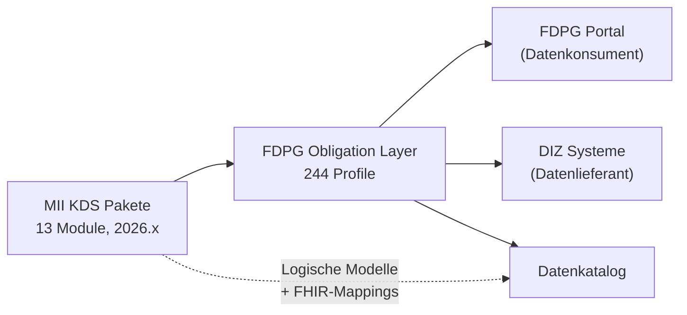
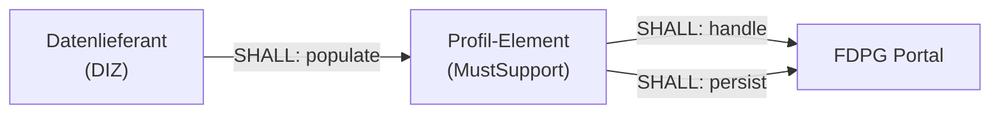
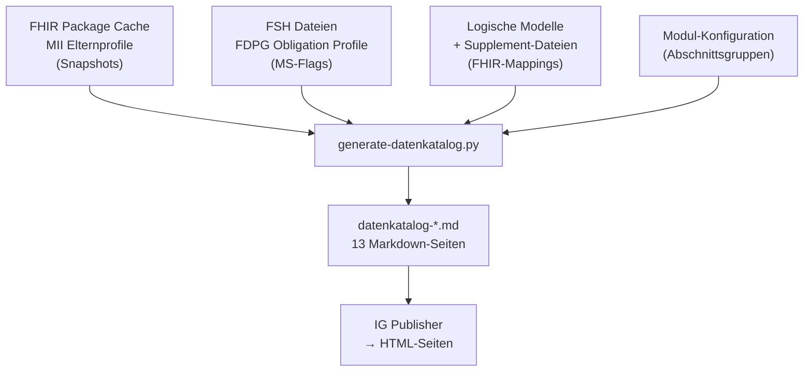

# FDPG KDS Obligations Layer -- Bericht für Modulsprecher

> Stand: 2026-02-25 | FDPG Obligation Layer v0.1.0 | 244 Profile, 13 Module

Dieses Dokument richtet sich an die **Modulsprecher der MII-Kerndatensatz-Module**.
Es erklärt die FDPG Obligation Layer, den Datenkatalog und zeigt pro Modul
den konkreten Handlungsbedarf zur Verbesserung der Datenqualität.

---

## 1. Architekturübersicht

### Was ist die FDPG Obligation Layer?

Die FDPG Obligation Layer ist ein **Overlay** über den MII-Kerndatensatz-Paketen (KDS).
Sie leitet 244 FHIR-Profile aus 13 KDS-Modulen ab und ergänzt:

- **MustSupport-Flags** -- welche Elemente für FDPG-Abfragen relevant sind
- **Obligations** -- maschinenlesbare Pflichten für Datenlieferanten (DIZ) und Datenkonsumenten (FDPG-Portal)
- **Übersetzungen** -- deutsche und englische Kurzbeschreibungen und Definitionen pro Element
- **Datenkatalog** -- menschenlesbare Dokumentation aller MustSupport-Elemente mit LM-Bezug

Die Upstream-KDS-Pakete bleiben **unverändert**. Die Obligation Layer ist ein reines Derivat.



### Obligation-Muster

Jedes MustSupport-Element bekommt Obligations für zwei Akteure:



- **Provider (DIZ):** `SHALL:populate` -- Element MUSS befüllt werden, wenn Daten vorhanden sind
- **Consumer (Portal):** `SHALL:handle` + `SHALL:persist` -- Element MUSS verarbeitet und gespeichert werden

### Enthaltene Module

| Modul | Paket | Version | Profile (ca.) |
|-------|-------|---------|--------------|
| Basisdaten | `...base` | 2026.0.0 | Person, Diagnose, Prozedur, Fall |
| Laborbefund | `...laborbefund` | 2026.0.1 | Laboruntersuchung, Servicerequest |
| Medikation | `...medikation` | 2026.0.0 | MedicationStatement, MedicationAdministration, ... |
| Biobank | `...biobank` | 2026.0.0 | Specimen, Substance, ... |
| Studie | `...studie` | 2026.0.2 | ResearchStudy, ResearchSubject, ... |
| Molekulargenetik | `...molgen` | 2026.0.4 | GenomicsReport, Variant, ... |
| Pathologiebefund | `...patho` | 2026.0.1 | DiagnosticReport, Specimen, ... |
| Intensivmedizin | `...icu` | 2026.0.1-rc1 | Vitalparameter, Beatmung, ... |
| Bildgebung | `...bildgebung` | 2026.0.0 | ImagingStudy, Series, Instance, ... |
| Seltene Erkrankungen | `...seltene` | 2026.0.0 | Condition, Observation, ... |
| Onkologie | `...onkologie` | 2026.0.1 | Diagnose, Therapie, TNM, ... |
| Einwilligung | `...consent` | 2026.0.1-rc-1 | Consent, Provision, ... |
| Dokument | `...dokument` | 2026.0.0 | DocumentReference |

---

## 2. Datenkatalog-Pipeline

Der Datenkatalog wird automatisch aus mehreren Quellen generiert:



### Was der Datenkatalog pro Element zeigt

| Spalte | Quelle | Beschreibung |
|--------|--------|-------------|
| **Fachbegriff (LM)** | Logisches Modell, FHIR-Mapping | Konzeptname aus dem LM, z.B. "KlinischerStatus" |
| **Beschreibung (LM)** | Logisches Modell, `short`/`definition` | Fachliche Beschreibung aus dem LM |
| **Deutsch (Kurz)** | Profil-Element, Translation-Extension | Deutsche Kurzbeschreibung (`_short`) |
| **Deutsch (Definition)** | Profil-Element, Translation-Extension | Deutsche Definition (`_definition`) |
| **Kommentar** | Profil-Element, Translation-Extension | Deutsche Kommentare, falls vorhanden |

### Warum FHIR-Mappings in Logischen Modellen wichtig sind

Die FHIR-Mappings in den Logischen Modellen sind der **Schlüssel** zur Verknüpfung:

1. Das LM definiert fachliche Konzepte (z.B. "KlinischerStatus", "Diagnosekode")
2. FHIR-Mappings verbinden diese Konzepte mit konkreten Profil-Elementen (z.B. `Condition.clinicalStatus`)
3. Der Datenkatalog nutzt diese Verbindung, um jedem MS-Element seinen Fachbegriff zuzuordnen

**Ohne FHIR-Mappings** erscheinen Elemente im Datenkatalog ohne LM-Bezug -- die fachliche Bedeutung fehlt.

---

## 3. Datenqualität: LM-Abdeckung

Die folgende Tabelle zeigt, wie viele MustSupport-Elemente jedes Moduls ein Mapping
im Logischen Modell haben. Daten aus dem [LM Coverage Report](lm-coverage-report.md).

### Module mit Logischem Modell und FHIR-Mappings

| Modul | Version | MS-Elemente | Abdeckung | Status |
|-------|---------|-------------|-----------|--------|
| Medikation | 2026.0.0 | 65 | **86%** | Gut |
| Bildgebung | 2026.0.0 | 110 | **79%** | Gut |
| Laborbefund | 2026.0.1 | 48 | **58%** | Mittel |
| Onkologie | 2026.0.1 | 735 | **47%** | Mittel |
| Molekulargenetik | 2026.0.4 | 210 | **35%** | Niedrig |
| Biobank | 2026.0.0 | 83 | **32%** | Niedrig |
| Basisdaten | 2026.0.0 | 80 | **20%** | Kritisch |
| Seltene Erkrankungen | 2026.0.0 | 200 | **20%** | Kritisch |

### Module mit LM, aber ohne FHIR-Mappings

Diese Module haben ein Logisches Modell im Paket, aber **keine FHIR-Mappings** in den LM-Elementen:

| Modul | Version | MS-Elemente (ca.) | LM-Elemente (Diff) | Problem |
|-------|---------|-------------------|--------------------|---------|
| Studie | 2026.0.2 | ~50 | 196 | LM `MII_LM_Studie_LogicalModel` vorhanden, 0 FHIR-Mappings |
| Pathologiebefund | 2026.0.1 | ~386 | 72 | LM `MII_LM_Patho_Logical_Model` vorhanden, 0 FHIR-Mappings |
| Intensivmedizin | 2026.0.1-rc1 | ~911 | 49 | LM `MII_LM_ICU_LogicalModel` vorhanden, 0 FHIR-Mappings |

### Module ohne LM im Paket

| Modul | Version | MS-Elemente (ca.) | Problem |
|-------|---------|-------------------|---------|
| Dokument | 2026.0.0 | ~17 | LM `MII_LM_Dokument` existiert auf Simplifier, aber nicht im publizierten Paket |
| Einwilligung | 2026.0.1-rc-1 | ~24 | Kein LM im Paket gefunden |

### Visuelle Übersicht

```
Medikation        ██████████████████████████████████████████░░░░░░░░  86%
Bildgebung        ████████████████████████████████████████░░░░░░░░░░  79%
Laborbefund       █████████████████████████████░░░░░░░░░░░░░░░░░░░░  58%
Onkologie         ███████████████████████░░░░░░░░░░░░░░░░░░░░░░░░░░  47%
Molekulargenetik  █████████████████░░░░░░░░░░░░░░░░░░░░░░░░░░░░░░░░  35%
Biobank           ████████████████░░░░░░░░░░░░░░░░░░░░░░░░░░░░░░░░░  32%
Basisdaten        ██████████░░░░░░░░░░░░░░░░░░░░░░░░░░░░░░░░░░░░░░░  20%
Seltene Erkr.     ██████████░░░░░░░░░░░░░░░░░░░░░░░░░░░░░░░░░░░░░░░  20%
Studie            ░░░░░░░░░░░░░░░░░░░░░░░░░░░░░░░░░░░░░░░░░░░░░░░░░   0%  (LM ohne Mappings)
Patho             ░░░░░░░░░░░░░░░░░░░░░░░░░░░░░░░░░░░░░░░░░░░░░░░░░   0%  (LM ohne Mappings)
ICU               ░░░░░░░░░░░░░░░░░░░░░░░░░░░░░░░░░░░░░░░░░░░░░░░░░   0%  (LM ohne Mappings)
Consent           ░░░░░░░░░░░░░░░░░░░░░░░░░░░░░░░░░░░░░░░░░░░░░░░░░   0%  (kein LM im Paket)
Dokument          ░░░░░░░░░░░░░░░░░░░░░░░░░░░░░░░░░░░░░░░░░░░░░░░░░   0%  (LM nicht im Paket)
```

---

## 4. Profil-Drift 2025 → 2026

Beim Übergang von 2025er auf 2026er Paketversionen wurden viele neue MustSupport-Elemente
hinzugefügt. Daten aus dem [Drift Report](lm-drift-report-2025-vs-2026.md).

### Zusammenfassung

| Modul | 2025 Version | 2026 Version | Neue Elemente | Davon im LM | Abdeckung neu |
|-------|-------------|-------------|---------------|-------------|---------------|
| Onkologie | 2025.0.0 | 2026.0.1 | 504 | 211 | 42% |
| Molekulargenetik | 2025.0.0 | 2026.0.4 | 183 | 68 | 37% |
| Biobank | 2025.0.0 | 2026.0.0 | 127 | 27 | 21% |
| Prozedur* | 2025.0.0 | 2026.0.0 | 90 | 0 | 0% |
| Diagnose* | 2025.0.1 | 2026.0.0 | 86 | 4 | 5% |
| Fall* | 2025.0.0 | 2026.0.0 | 86 | 0 | 0% |
| Person* | 2025.0.0 | 2026.0.0 | 53 | 0 | 0% |
| Laborbefund | 2025.0.0 | 2026.0.1 | 4 | 1 | 25% |
| Medikation | 2025.0.0 | 2026.0.0 | 0 | 0 | -- |
| **Gesamt** | | | **1.133** | **311** | **27%** |

*\* Diagnose, Person, Prozedur, Fall gehören zum Modul Basisdaten.*

### Kernaussage

Von **1.133 neuen MustSupport-Elementen** über alle Module hinweg haben nur **311 (27%)**
ein Mapping im Logischen Modell. Das bedeutet: fast drei Viertel der neuen Elemente
erscheinen im Datenkatalog ohne fachlichen Kontext.

```
Neue Elemente 2025 → 2026:

Onkologie         ████████████████████████████████████████████████ 504  (211 im LM)
Molgen            █████████████████ 183                              (68 im LM)
Biobank           ████████████ 127                                   (27 im LM)
Prozedur*         █████████ 90                                       (0 im LM)
Diagnose*         ████████ 86                                        (4 im LM)
Fall*             ████████ 86                                        (0 im LM)
Person*           █████ 53                                           (0 im LM)
Laborbefund       █ 4                                                (1 im LM)
Medikation        0                                                  --

█ = im LM gemapped    █ = nicht gemapped
```

---

## 5. Handlungsbedarf pro Modul

### Basisdaten (Diagnose, Person, Prozedur, Fall) -- Kritisch

**Abdeckung: 20% (16/80 Elemente)**

**Problem:** Person und Fall haben **keine FHIR-Mappings** im Logischen Modell.
Diagnose und Prozedur haben Mappings, aber nur für wenige Elemente.

**Drift:** 315 neue Elemente in 2026, davon nur 4 im LM gemapped.

**Handlungsbedarf:**
- [ ] FHIR-Mappings in `MII_LM_Person` erstellen (aktuell 0 Mappings)
- [ ] FHIR-Mappings in `MII_LM_Fall` erstellen (aktuell 0 Mappings)
- [ ] FHIR-Mappings in `MII_LM_Diagnose` erweitern (64 Elemente ohne Match)
- [ ] FHIR-Mappings in `MII_LM_Prozedur` erweitern (aktuell nur 3 Mappings)

> **Hinweis:** Für Person und Fall haben wir lokale Supplement-Dateien (`lm-supplement-person.json`,
> `lm-supplement-fall.json`) erstellt, die die fehlenden Mappings als Workaround bereitstellen.
> Idealerweise sollten diese Mappings im Upstream-LM ergänzt werden.

---

### Seltene Erkrankungen -- Kritisch

**Abdeckung: 20% (ca. 40/200 Elemente)**

**Problem:** Das LM existiert und hat FHIR-Mappings, aber nur für einen Bruchteil der MS-Elemente.

**Handlungsbedarf:**
- [ ] FHIR-Mappings in `MII_LM_Seltene` für die ~160 unmapped Elemente erweitern
- [ ] Insbesondere: Condition, Observation, FamilyMemberHistory Elemente prüfen

---

### Biobank -- Niedrig

**Abdeckung: 32% (27/83 Elemente)**

**Drift:** 127 neue Elemente in 2026, davon 27 im LM gemapped. 36 Elemente wurden entfernt.

**Handlungsbedarf:**
- [ ] FHIR-Mappings in `Biobank` LM für ~56 unmapped Elemente ergänzen
- [ ] Neue 2026er Elemente (Specimen, Substance) im LM abbilden

---

### Molekulargenetik -- Niedrig

**Abdeckung: 35% (ca. 74/210 Elemente)**

**Drift:** 183 neue Elemente in 2026, davon 68 im LM gemapped -- vergleichsweise gute Abdeckung der neuen Elemente.

**Handlungsbedarf:**
- [ ] FHIR-Mappings für verbleibende ~115 alte unmapped Elemente ergänzen
- [ ] GenomicsReport- und Variant-Elemente im LM prüfen

---

### Onkologie -- Mittel

**Abdeckung: 47% (ca. 345/735 Elemente)**

**Drift:** 504 neue Elemente in 2026 (größter Zuwachs aller Module), davon 211 im LM -- 42% Abdeckung der neuen Elemente.

> **Hinweis:** `MII_LM_MVGenomSeq_Onkologie` ist ein separates LM (Molekulare Diagnostik)
> und wird hier nicht zum Onkologie-Handlungsbedarf gezählt.

**Handlungsbedarf:**
- [ ] FHIR-Mappings für ~293 neue 2026er Elemente ohne LM-Match ergänzen
- [ ] Besonders: Organspezifische Zusatzmodule und Therapie-Profile prüfen
- [ ] Gute Basis vorhanden (`MII_LM_Onko` + `MII_LM_Onko_Organspezifische_Zusatzmodule`) -- inkrementelle Verbesserung möglich

---

### Laborbefund -- Mittel

**Abdeckung: 58% (28/48 Elemente)**

**Drift:** Nur 4 neue Elemente in 2026 -- stabiles Modul.

**Handlungsbedarf:**
- [ ] FHIR-Mappings für ~20 unmapped Elemente ergänzen
- [ ] Insbesondere: ServiceRequest-Elemente und Referenzbereiche prüfen

---

### Medikation -- Gut

**Abdeckung: 86% (56/65 Elemente)**

**Drift:** Keine neuen Elemente in 2026 -- sehr stabiles Modul.

**Handlungsbedarf:**
- [ ] Optionale Nachbesserung: 9 verbleibende Elemente im LM ergänzen
- [ ] Kein dringender Handlungsbedarf

---

### Bildgebung -- Gut

**Abdeckung: 79% (87/110 Elemente)**

**Drift:** Nicht im Drift-Report enthalten (kein 2025er Paket zum Vergleich).

**Handlungsbedarf:**
- [ ] FHIR-Mappings für ~23 unmapped Elemente ergänzen
- [ ] Kein dringender Handlungsbedarf -- gute Basis vorhanden

---

### Intensivmedizin (ICU) -- LM ohne FHIR-Mappings

**MS-Elemente: ~911 | Abdeckung: 0%**

**Problem:** LM `MII_LM_ICU_LogicalModel` existiert im Paket (49 Elemente), hat aber
**keine FHIR-Mapping-Deklarationen**. Es gibt ggf. ein zweites LM auf Simplifier (`MII_LM_ICU`).

**Handlungsbedarf:**
- [ ] FHIR-Mappings (`identity: FHIR`) in `MII_LM_ICU_LogicalModel` ergänzen
- [ ] Ggf. zweites LM (`MII_LM_ICU`) mit FHIR-Mappings versehen und ins Paket aufnehmen
- [ ] Priorität: mindestens Vitalparameter- und Beatmungsprofile abdecken

---

### Pathologiebefund -- LM ohne FHIR-Mappings

**MS-Elemente: ~386 | Abdeckung: 0%**

**Problem:** LM `MII_LM_Patho_Logical_Model` existiert im Paket (72 Elemente mit fachlichen
Beschreibungen), hat aber **keine FHIR-Mapping-Deklarationen** (`mapping: []`).

**Handlungsbedarf:**
- [ ] FHIR-Mappings (`identity: FHIR`) in `MII_LM_Patho_Logical_Model` ergänzen
- [ ] 72 LM-Konzepte (Identifikation, Status, Untersuchungsauftrag, ...) auf Profil-Elemente mappen
- [ ] DiagnosticReport- und Specimen-Elemente priorisieren

---

### Studie -- LM ohne FHIR-Mappings

**MS-Elemente: ~50 | Abdeckung: 0%**

**Problem:** LM `MII_LM_Studie_LogicalModel` existiert im Paket (196 Elemente),
hat aber **keine FHIR-Mapping-Deklarationen**.

**Handlungsbedarf:**
- [ ] FHIR-Mappings (`identity: FHIR`) in `MII_LM_Studie_LogicalModel` ergänzen
- [ ] 196 LM-Konzepte auf ResearchStudy- und ResearchSubject-Elemente mappen

---

### Einwilligung (Consent) -- Kein LM im Paket

**MS-Elemente: ~24 | Abdeckung: 0%**

**Problem:** Kein Logisches Modell im publizierten Paket gefunden.

**Handlungsbedarf:**
- [ ] LM erstellen und mit FHIR-Mappings versehen, oder vorhandenes LM ins Paket aufnehmen
- [ ] Überschaubare Elementzahl -- geringer Aufwand

---

### Dokument -- LM nicht im Paket

**MS-Elemente: ~17 | Abdeckung: 0%**

**Problem:** LM `MII_LM_Dokument` existiert auf Simplifier (Draft, 2026.0.0),
ist aber **nicht im publizierten Paket** enthalten.

**Handlungsbedarf:**
- [ ] `MII_LM_Dokument` in das publizierte Paket aufnehmen
- [ ] FHIR-Mappings im LM ergänzen (falls nicht vorhanden)
- [ ] Geringe Elementzahl -- minimaler Aufwand

---

## 6. Fehlende Module

Die folgenden Module sind **nicht** in der FDPG Obligation Layer enthalten:

| Modul | Grund | Erwartete Verfügbarkeit |
|-------|-------|------------------------|
| **Symptom** | Paket 2026.0.0 noch nicht auf FHIR-Registry publiziert | Sobald auf packages.fhir.org verfügbar |
| **Mikrobiologie** | Kein 2026.x-Paket publiziert | Ausstehend |
| **PRO (Patient-Reported Outcomes)** | `...pros` 2026.0.1 auf FHIR-Registry verfügbar (LM `MII_LM_PRO` auf Simplifier) -- Aufnahme ausstehend | Kurzfristig integrierbar |
| **MTB (Molecular Tumor Board)** | 2026.0.0 auf FHIR-Registry verfügbar -- Aufnahme ausstehend | Kurzfristig integrierbar |
| **Strukturdaten** | Nicht relevant für FDPG-Abfragen | -- |
| **Kardiologie** | Alpha-Status, nicht stabil genug | Nach Stabilisierung |
| **Lungenfunktion** | Nicht als 2026.x publiziert | Ausstehend |

---

## 7. Nächste Schritte

### Bitte an alle Modulsprecher

1. **Abdeckungsliste prüfen:** Der [LM Coverage Report](lm-coverage-report.md) zeigt pro Modul
   jedes Element mit und ohne LM-Match. Bitte prüfen Sie die Liste für Ihr Modul.

2. **FHIR-Mappings ergänzen:** Für Elemente ohne LM-Match: bitte im Logischen Modell
   des jeweiligen Upstream-KDS-Pakets FHIR-Mappings ergänzen. Das Mapping hat die Form:
   ```
   identity: FHIR
   map: ResourceType.elementName
   ```

3. **Deutsche Übersetzungen:** Falls Profil-Elemente keine deutschen `_short`- oder
   `_definition`-Translations haben, werden im Datenkatalog nur englische FHIR-Defaults angezeigt.
   Ergänzungen verbessern die Nutzbarkeit für medizinisches Fachpersonal.

4. **FHIR-Mappings in bestehenden LMs:** ICU, Patho und Studie haben Logische Modelle,
   aber keine FHIR-Mappings -- diese müssen ergänzt werden (s. Abschnitt 5).
   Dokument hat ein LM auf Simplifier, das ins Paket aufgenommen werden sollte.
   Consent benötigt ein neues LM.

### Priorisierung

| Priorität | Modul | Aufwand | Wirkung |
|-----------|-------|---------|---------|
| **Hoch** | Basisdaten (Person, Fall) | Mittel | Fehlende Grunddaten-Konzepte |
| **Hoch** | Seltene Erkrankungen | Mittel | Nur 20% Abdeckung trotz LM |
| **Hoch** | ICU | Hoch | 911 Elemente, LM ohne FHIR-Mappings |
| **Mittel** | Onkologie | Mittel | Viele neue 2026er Elemente |
| **Mittel** | Biobank | Niedrig | 56 Elemente nachzutragen |
| **Mittel** | Molekulargenetik | Niedrig | 115 Elemente nachzutragen |
| **Mittel** | Pathologiebefund | Mittel | 386 Elemente, LM ohne FHIR-Mappings |
| **Niedrig** | Laborbefund | Niedrig | 20 Elemente nachzutragen |
| **Niedrig** | Studie | Niedrig | ~50 Elemente |
| **Niedrig** | Consent | Minimal | ~24 Elemente |
| **Niedrig** | Dokument | Minimal | ~17 Elemente |
| -- | Medikation, Bildgebung | Minimal | Bereits gut abgedeckt |

### Zeitplan

- **Kurzfristig (2026 Q1):** Modulsprecher prüfen die Gap-Listen
- **Mittelfristig (2026.1 Update):** FHIR-Mappings und Übersetzungen in Upstream-Paketen ergänzen
- **Langfristig:** Automatisierte Abdeckungsprüfung in CI/CD der KDS-Pakete

---

## Anhang: Referenzen

- [LM Coverage Report](lm-coverage-report.md) -- Detaillierte Element-Listen pro Modul
- [LM Drift Report 2025 → 2026](lm-drift-report-2025-vs-2026.md) -- Neue/entfernte Elemente
- [Datenkatalog-Generator](../scripts/generate-datenkatalog.py) -- Python-Script zur Datenkatalog-Erzeugung
- [FDPG Obligation Layer IG](https://medizininformatik-initiative.github.io/kds-fdpg-layer/) -- Publizierter Implementation Guide
